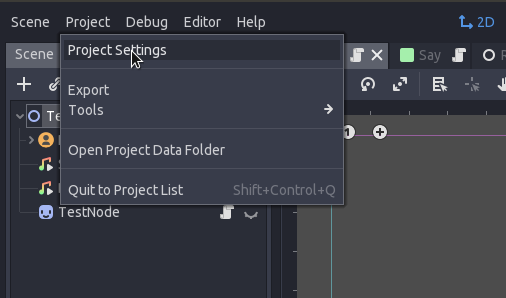
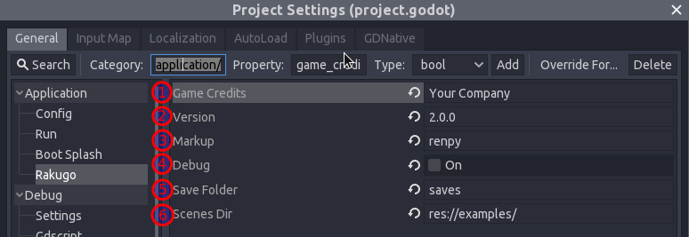
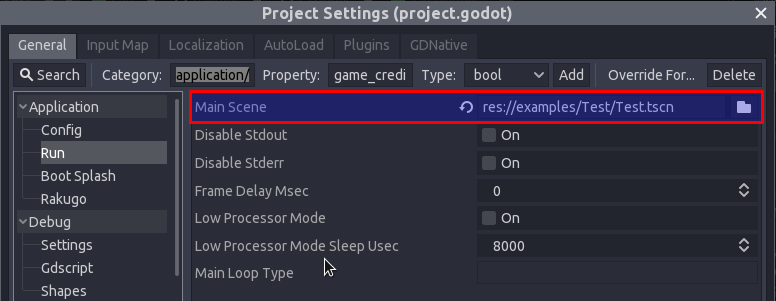
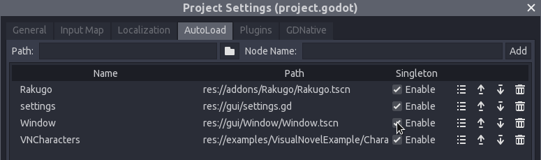

# Config

	
Attention

	

		For now we assume that you start your project by modify one of our templates.
	

To config Rakugo project go to menu *Project > Project Setting*:

The in **Project Setting** at tab **General** choose category *Application > Rakugo*.

	
Note

	

		Values at this screenshot are default.
	

Here you have values:

  1. `Game Credits` :
	Just who made this game (you silly  ).
	You can access this variable in game as `game_credits`.

  1. `Version` :
	*String* that represent your game version.
	You can access this variable in game as `game_version`.

  1. `Markup` :
	*String* that set what markup language is used as default in dialogues strings and Rakguo Text nodes.
	You have this options:
	 - `renpy` : Markup thats almost the same as used by Ren'Py project
  
	 - `bbcode` : BBCode with additional markups
  

  1. `Debug` :
	*Bool* that turn on/off debug prints from Rakugo - that is all prints make using `Rakugo.debug()` function.

  1. `Save Folder`:
	Just name of folder with Rakugo game saves you can change it if you want

  1. `Scenes Dir` :
  

    
Attention

    

        You probability must change it.
    

  It is path to folder with all your dialogues scenes (they can be in subfolders).
  Is used by methods: `Rakugo.jump()` and `Rakugo.begin()` to change scenes.

After this go to category *Application > Run*.

And change `Main Scene` to one which start your game.

Gui is provided by template as AutoLoads: `settings` and `Window` you can remove the rest if you familiar with temple scene that you use them or and you don't you use them in your game.
To do this go to tab **AutoLoad**.
